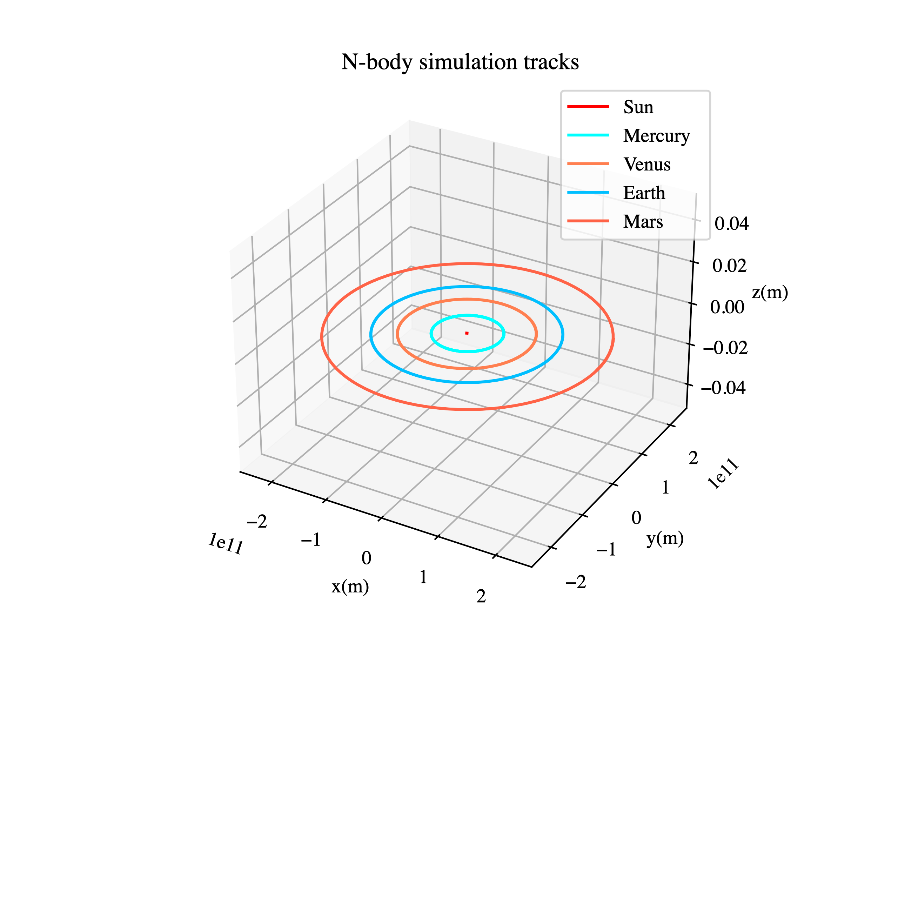
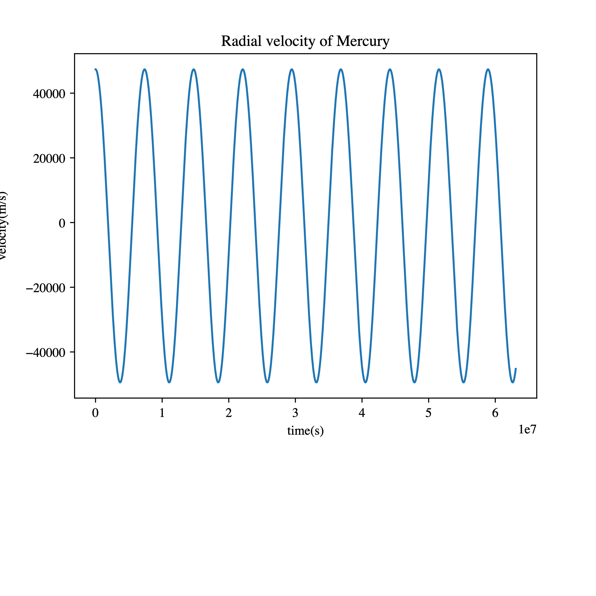
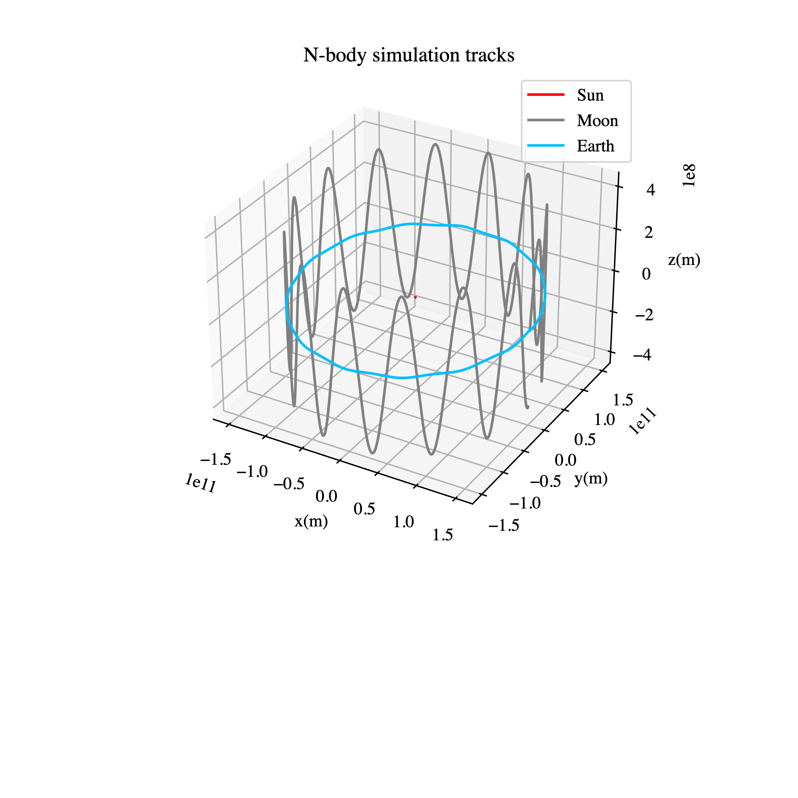

# Adfīnitās

Julia N-body simulation package, support parallel and distributed computing.  

* * *  

Package dependency: Distributed, DistributedArrays, ProgressMeter;

Example dependenchy: Jupyter Notebook, PyPlot, PyCall;

* * *  

Example: examples/examples.ipynb

1. Solar system up to Jupiter;  
    a. Plot orbits on 3D;  
          
    b. Animate planets and solar's tracks;  
          
    c. Plot the radial velocity of Sun and Mercury;  
          
          
2. Sun-Earth-Moon system, but Moon has velocity on z-axis;  
    a. 3D orbits plot;  
          
3. N-Body simulation with a galaxy;  
    a. 100-body animate on 2D;  
          
    b. 1000-body animate on 3D;  
          
